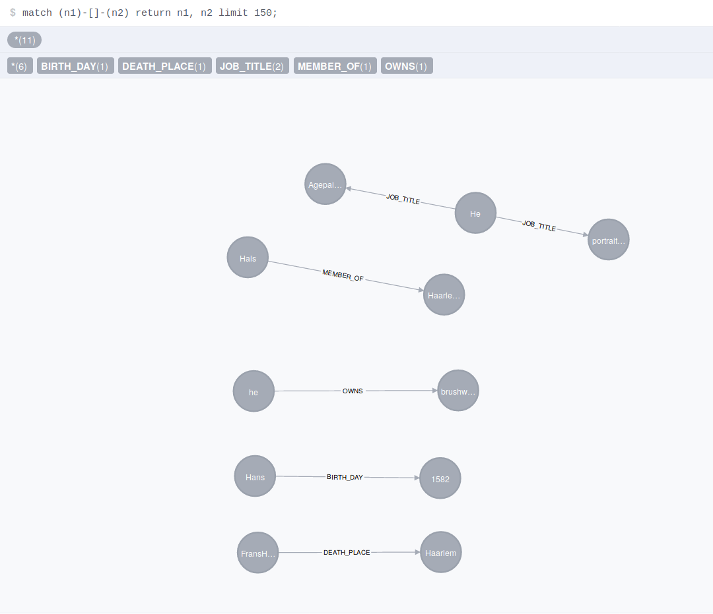

Pynsett: A lightweight relation extraction tool
===============================================

Installation
------------

The basic version can be installed by typing
```bash
pip3 install pynsett
```

The system is now installed, however the parser requires an additional module. You will need to type
```bash
python3 -m spacy download en_core_web_sm
```

If you want a better synonym matching, please another additional models with the glove vectors
```bash
python3 -m pynsett download
```

What is Pynsett
---------------

Pynsett is a programmable relation extractor. 
The user sets up a set of rules which are used to parse any English text. 
As a result, Pynsett returns a list of triplets as defined in the rules.


Example usage
-------------

Let's assume we want to extract wikidata relations from a file named 'test.txt'.
An example code would be

```python
from pynsett.discourse import Discourse
from pynsett.extractor import Extractor
from pynsett.auxiliary.prior_knowedge import get_wikidata_knowledge


if __name__ == "__main__":
    text = open('test.txt').read()
    discourse = Discourse(text)

    extractor = Extractor(discourse, get_wikidata_knowledge())
    triplets = extractor.extract()

    for triplet in triplets:
        print(triplet)
```

The distribution comes with two sets of rules: The generic knowledge, accessible using
pynsett.auxiliary.prior_knowledge.get_generic_knowledge(), and the wikidata knowledge, which
can be loaded using pynsett.auxiliary.prior_knowledge.get_wikidata_knowledge()


Create new rules for extraction
-------------------------------

Let's assume we are writing a new file called "my_own_rules.rules".
An example of a new set of rules can be the following:

```bash
MATCH "Jane#1 is an engineer#2"
CREATE (HAS_ROLE 1 2);
```

Here the symbol #1 gives a label to 'Jane' and #2 gives a label to 'engineer'. 
These labels can be used when creating the relation '(IS_A 1 2)'.

A more generic rule uses the entity types (Jane is a PERSON)
```bash
MATCH "{PERSON}#1 is an engineer#2"
CREATE (HAS_ROLE 1 2);
```

This rule matches all the sentences where the subject is a person (compatibly with the internal
NER). The name of the person is associated to the node.

There are 18 entity types that you can type within brackets:
CARDINAL, DATE, EVENT, FAC, GPE, LANGUAGE, LAW, LOC, MONEY, NORP, ORDINAL,
ORG, PERCENT, PERSON, PRODUCT, QUANTITY, TIME, WORK_OF_ART

There you go, a person is now connected with a role: Node 1 is whoever matches for node 1 and
the profession is "engineer". The properties of the words are put into node 1 and 2.

This seems a little bit limiting, because the previous relations only works for engineers.
Let us define a `word cloud` and call it "ROLE".

```bash
DEFINE ROLE AS [engineer, architect, physicist, doctor];

MATCH "{PERSON}#1 is a ROLE#2"
CREATE (HAS_ROLE 1 2);
```

As a final touch let us make the text a little bit nicer to the eyes: Let's use PERSON instead
of {PERSON}

```bash
DEFINE PERSON AS {PERSON};
DEFINE ROLE AS [engineer, architect, physicist, doctor];

MATCH "PERSON#1 is a ROLE#2"
CREATE (HAS_ROLE 1 2);
```

A working example of pynsett's rules is in [this file](https://github.com/fractalego/pynsett/blob/master/pynsett/rules/wikidata.rules).


Use the extraction rules
------------------------

If you have a specific file with the extraction rules, you can load it by creating a new
Knowledge object:

```python
from pynsett.discourse import Discourse
from pynsett.extractor import Extractor
from pynsett.knowledge import Knowledge


if __name__ == "__main__":
    text = open('test.txt').read()
    discourse = Discourse(text)

    knowledge = Knowledge()
    knowledge.add_rules(open('./my_own_rules.rules').read())

    extractor = Extractor(discourse, knowledge)
    triplets = extractor.extract()

    for triplet in triplets:
        print(triplet)
```

Import the triplets into Neo4J
------------------------------

The triplets can be imported into a proper graph database. As an example, let us do it for Neo4j.  
You would need to install the system onto your machine, as well as installing the python package 
'py2neo'. After everything is set up, you can run the following script.

```python
from py2neo import Graph
from pynsett.discourse import Discourse
from pynsett.extractor import Extractor
from pynsett.auxiliary.prior_knowedge import get_wikidata_knowledge

if __name__ == "__main__":
    knowledge = get_wikidata_knowledge()

    text = open('sample_wikipedia.txt').read()

    discourse = Discourse(text)
    extractor = Extractor(discourse, knowledge)
    triplets = extractor.extract()

    graph = Graph('http://localhost:7474/db/data/')
    for triplet in triplets:
        graph.run('MERGE (a {text: "%s"}) MERGE (b {text: "%s"}) CREATE (a)-[:%s]->(b)'
                  % (triplet[0],
                     triplet[2],
                     triplet[1]))

```

This script works on an example page called 'sample_wikipedia.txt' that you will have to provide. The result 
on the Neo4J browser should look like the next picture (Extracted from the Wikipedia page of Franz Hals the Elder):




Known issues and shortcomings
-----------------------------

* The system is still a little bit slow (about 0.07 sec per sentence)
* Anaphora is not done 