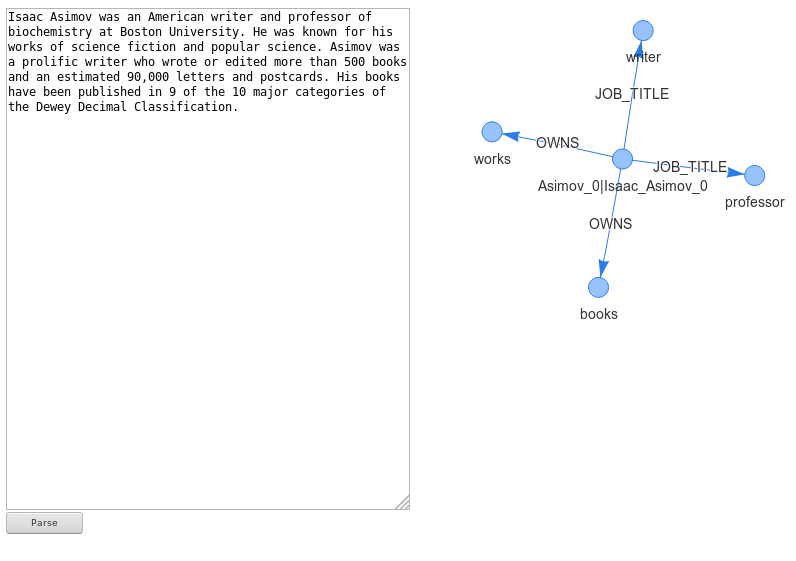
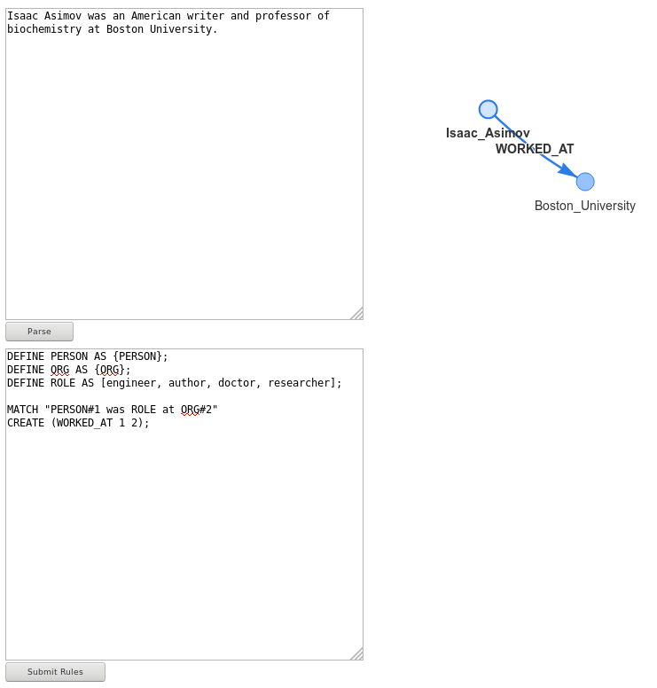
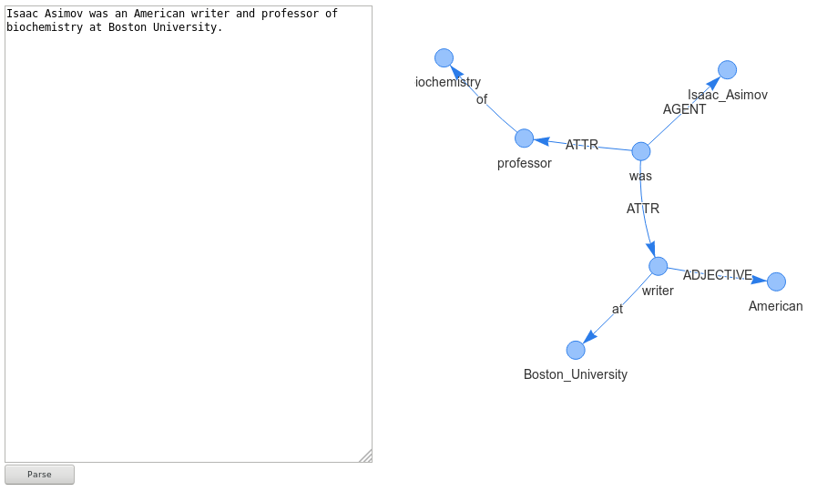

Pynsett: A programmable relation extraction tool
===============================================

Installation
------------

Before installing the package you need to install the tools for compiling python-igraph
```bash
sudo apt-get install build-essential python-dev python3-dev
```

The basic version can be installed by typing
```bash
virtualenv --python=/usr/bin/python3 .env
pip install pynsett
```

The system is now installed, however the parser requires an additional module from Spacy and AllenNLP. You will need to type
```bash
python3 -m spacy download en_core_web_lg
python3 -m pynsett download
```


What is Pynsett
---------------

Pynsett is a programmable relation extractor. 
The user sets up a set of rules which are used to parse any English text. 
As a result, Pynsett returns a list of triplets as defined in the rules.


Example usage
-------------

Let's assume we want to extract wikidata relations from a file named 'test.txt'.
An example code would be

```python
from pynsett.discourse import Discourse
from pynsett.extractor import Extractor
from pynsett.auxiliary.prior_knowedge import get_wikidata_knowledge


text = open('test.txt').read()
discourse = Discourse(text)

extractor = Extractor(discourse, get_wikidata_knowledge())
triplets = extractor.extract()

for triplet in triplets:
    print(triplet)
```

The distribution comes with two sets of rules: The generic knowledge, accessible using
pynsett.auxiliary.prior_knowledge.get_generic_knowledge(), and the wikidata knowledge, which
can be loaded using pynsett.auxiliary.prior_knowledge.get_wikidata_knowledge()


Create new rules for extraction
-------------------------------

Let's assume we are writing a new file called "my_own_rules.rules".
An example of a new set of rules can be the following:

```bash
MATCH "Jane#1 is an engineer#2"
CREATE (HAS_ROLE 1 2);
```

Here the symbol #1 gives a label to 'Jane' and #2 gives a label to 'engineer'. 
These labels can be used when creating the relation '(IS_A 1 2)'.

A more generic rule uses the entity types (Jane is a PERSON)
```bash
MATCH "{PERSON}#1 is an engineer#2"
CREATE (HAS_ROLE 1 2);
```

This rule matches all the sentences where the subject is a person (compatibly with the internal
NER). The name of the person is associated to the node.

There are 18 entity types that you can type within brackets:
CARDINAL, DATE, EVENT, FAC, GPE, LANGUAGE, LAW, LOC, MONEY, NORP, ORDINAL,
ORG, PERCENT, PERSON, PRODUCT, QUANTITY, TIME, WORK_OF_ART

There you go, a person is now connected with a role: Node 1 is whoever matches for node 1 and
the profession is "engineer". The properties of the words are put into node 1 and 2.

This seems a little bit limiting, because the previous relations only works for engineers.
Let us define a `word cloud` and call it "ROLE".

```bash
DEFINE ROLE AS [engineer, architect, physicist, doctor];

MATCH "{PERSON}#1 is a ROLE#2"
CREATE (HAS_ROLE 1 2);
```

As a final touch let us make the text a little bit nicer to the eyes: Let's use PERSON instead
of {PERSON}

```bash
DEFINE PERSON AS {PERSON};
DEFINE ROLE AS [engineer, architect, physicist, doctor];

MATCH "PERSON#1 is a ROLE#2"
CREATE (HAS_ROLE 1 2);
```

A working example of pynsett's rules is in [this file](https://github.com/fractalego/pynsett/blob/master/pynsett/rules/wikidata.rules).


Use the extraction rules
------------------------

If you have a specific file with the extraction rules, you can load it by creating a new
Knowledge object:

```python
from pynsett.discourse import Discourse
from pynsett.extractor import Extractor
from pynsett.knowledge import Knowledge


text = open('test.txt').read()
discourse = Discourse(text)

knowledge = Knowledge()
knowledge.add_rules(open('./my_own_rules.rules').read())

extractor = Extractor(discourse, knowledge)
triplets = extractor.extract()

for triplet in triplets:
    print(triplet)
```

Import the triplets into Neo4J
------------------------------

The triplets can be imported into a proper graph database. As an example, let us do it for Neo4j.  
You would need to install the system onto your machine, as well as installing the python package 
'py2neo'. After everything is set up, you can run the following script.

```python
from py2neo import Graph
from pynsett.discourse import Discourse
from pynsett.extractor import Extractor
from pynsett.auxiliary.prior_knowedge import get_wikidata_knowledge

knowledge = get_wikidata_knowledge()
text = open('sample_wikipedia.txt').read()

discourse = Discourse(text)
extractor = Extractor(discourse, knowledge)
triplets = extractor.extract()

graph = Graph('http://localhost:7474/db/data/')
for triplet in triplets:
    graph.run('MERGE (a {text: "%s"}) MERGE (b {text: "%s"}) CREATE (a)-[:%s]->(b)'
              % (triplet[0],
                 triplet[2],
                 triplet[1]))
```

This script works on an example page called 'sample_wikipedia.txt' that you will have to provide.


Using the internal Web Server
----------------------------

To start the internal web server you can write the following

```python3
from pynsett.server import pynsett_app
pynsett_app.run(debug=True, port=4001, host='0.0.0.0', use_reloader=False)
```

which will open a flask app at `localhost:4001`.

### Web interface

The server provides three web interfaces:

#### A Wikidata relation extractor at http://localhost:4001/wikidata



#### A Programmable relation extractor at http://localhost:4001/relations



#### A Neo-Davidsonian representation of a text at http://localhost:4001




## API

The wikidata relation extractor API can be called with

```python3
import json
import requests

text = "John is a writer."
triplets = json.loads(requests.post('http://localhost:4001/api/wikidata', json={'text': text}).text)
print(triplets)
```

with output:
```python3
[['John', 'JOB_TITLE', 'writer']]
```

The rules can programmed by posting as in the following
```python3
import json
import requests

rules = """
DEFINE PERSON AS {PERSON};
DEFINE ORG AS {ORG};
DEFINE ROLE AS [engineer, author, doctor, researcher];

MATCH "PERSON#1 was ROLE at ORG#2"
CREATE (WORKED_AT 1 2);
"""

triplets = json.loads(requests.post('http://localhost:4001/api/set_rules', json={'text': rules}).text)
```

These rules are then used at the following API endpoint
```python3
import json
import requests

text = "Isaac Asimov was an American writer and professor of biochemistry at Boston University."
triplets = json.loads(requests.post('http://localhost:4001/api/relations', json={'text': text}).text)
print(triplets)
```


The Neo-Davidsonian representation API can be called with

```python3
import json
import requests
text = "John is tall."
graph = json.loads(requests.post('http://localhost:4001/api/drt', json={'text': text}).text)
print(graph)
```

with output:
```python3
{'edges': [{'arrows': 'to', 'from': 'v1', 'label': 'AGENT', 'to': 'v0'},
                                       {'arrows': 'to', 'from': 'v1', 'label': 'ADJECTIVE', 'to': 'v2'}],
                             'nodes': [{'id': 'v1', 'label': 'is'},
                                       {'id': 'v0', 'label': 'John'},
                                       {'id': 'v2', 'label': 'tall'}]}
```


Pre-Formatting of the Text
--------------------------

The text must be submitted respecting the following rules:
* No parenthesis (...) nor brackets [...]. The parser is confused by those.
* The paragraphs must be separated by *1 empty line*. Dividing a text into paragraphs helps with anaphora.
   ```bash
   This is paragraph 1.

   This is paragraph 2.
   ```


Known issues and shortcomings
-----------------------------

* Speed! Parsing is done one sentence at a time
* Anaphora only works inside paragraphs
* Anaphora is done through AllenNLP, with can be slow-ish without a GPU
* The text needs to be cleaned and pre-formatted. This is not an issue _per se_ but it must be kept in mind
